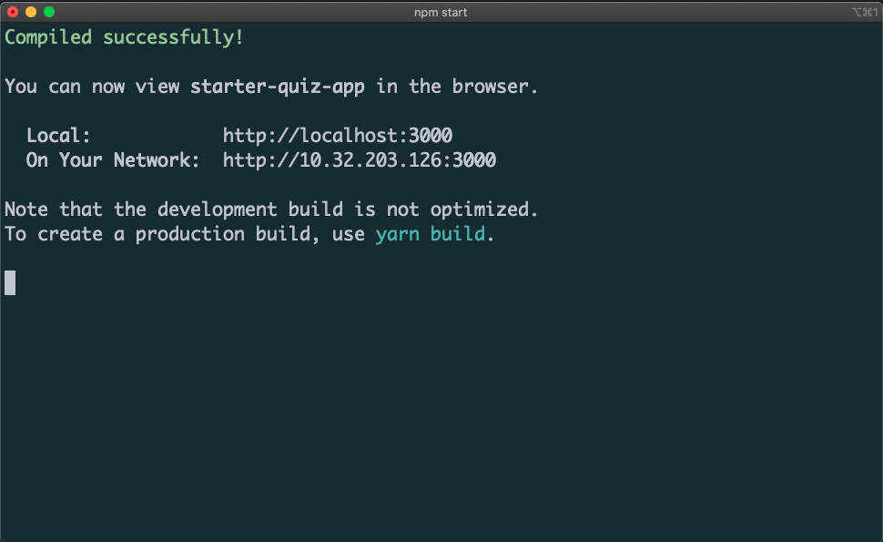

# 개발 환경 셋팅하기

## 1. VS Code 설치하기

우리 프로젝트에서는 `VS Code` 를 기본 코드 에디터로 사용할 예정입니다.

[VS Code 공식 홈페이지](https://code.visualstudio.com/)에서 다운로드 받아 설치 해주세요.

## 2. Node.js 설치하기

[Node.js 공식 홈페이지](https://nodejs.org/en/)에서 왼쪽에 있는 Node.js LTS 버전을 설치합니다.


```bash
# Ain't no code for that yet, sorry
echo 'You got to trust me on this, I saved the world'
```


> React를 공부하는데 Node.js는 왜 설치해야 하나요? javascript로 작성된 라이브러리를 설치할 때, 사용하는 NPM을 사용하기 위함 입니다. NPM은 Node.js가 설치가 되면 자동으로 설치가 됩니다.


## 3. React 프로젝트 시작하기

터미널을 열고, react 프로젝트를 생성하는 아래의 명령어를 실행합니다. 


혹 터미널이  않다면 글 마지막 터미널 셋팅 방법을 확인해 주세요


```jsx
npx create-react-app starter-quiz-app
```

`npx`는 설치하지 않았는데, 어떤 명령어 인가요? `npx`는 `npm`의 확장 버전으로 `npm`이 하지 못했던 일들을 추가적으로 할 수 있게 도와줍니다. 또한 `npx`는 `npm`이 설치되면 자동으로 설치가 됩니다.

`create-react-app`은 뭔가? `react` 어플리케이션을 쉽게 만들어 주는 도구입니다. 예전에는 `react`를 실행 하려면 여러 라이브러리들을 같이 설치했어야 했는데, 이러한 불편함을 한 방에 해결해주는 고마운 도구에요 🙇‍♂️ 🙇‍♂️

설치가 완료되면 `ls` 명령어를 통해 실행한 경로에 `starter-quiz-app` 이 생긴 것을 확인 하실 수 있습니다.

이제 `react` 코드를 실행해 보도록 하겠습니다.

`cd` 명령어로 폴더로 이동하고, `npm run` 명령어를 통해 react 코드를 실행합니다.

```jsx
cd starter-quiz-app
npm start
```

코드를 실행하면, 아래와 같은 화면이 뜨면서 정상적으로 `react` 코드가 실행된 것을 볼 수 있습니다.



터미널에 적혀 있는 `http://localhost:3000` 주소로 접속해 보도록 하겠습니다.


위와 같은 화면이 뜬다면, `React`가 정상적으로 실행되었고, `React`에 입문하시게 된 것 입니다.

축하드립니다 👏👏👏

이 주소는 앞으로 웹페이지를 확인하는 주소로 계속해서 사용하게 될 것이니 잘 알아두세요.

## 4. Something More !!!

반드시 공부해야 하는 건 아니지만, 도움이 될 만한 자료들을 공유하고 있습니다.

* `Javascript` 패키지 도구로는 `yarn`과 `npm`이 있습니다.  
  * 읽어보기 👉 [https://devgunho.tistory.com/entry/Yarn-vs-npm-Package-Manager](https://devgunho.tistory.com/entry/Yarn-vs-npm-Package-Manager)
* `create-react-app`은 유용한 기능들을 많이 가지고 있습니다.
  * 읽어보기 👉 [https://create-react-app.dev/docs/getting-started](https://create-react-app.dev/docs/getting-started)
* `VS Code`에서 터미널 창 실행하기




* git bash 설치하기  윈도우는 기본적으로 리눅스 명령어가 작동하지 않습니다. 그래서 우선 `git bash` 설치가 필요합니다.
  * 설치하기 👉 [ https://tnsgud.tistory.com/648](%20https://tnsgud.tistory.com/648)
* vs-code 에서 default로 git bash 사용하도록 설정하기
  * 기본 코드 에디터로 설정하기 👉 [https://blog.crois.net/2020/04/17/vscode-gitbash-%EC%84%A4%EC%A0%95/](https://blog.crois.net/2020/04/17/vscode-gitbash-%EC%84%A4%EC%A0%95/)



`vs-code` 상단 메뉴 View → Terminal을 클릭하면 터미널 창이 열리는 것을 확인 할 수 있습니다.



