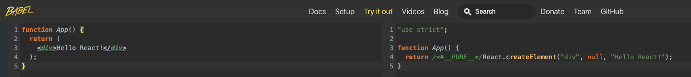
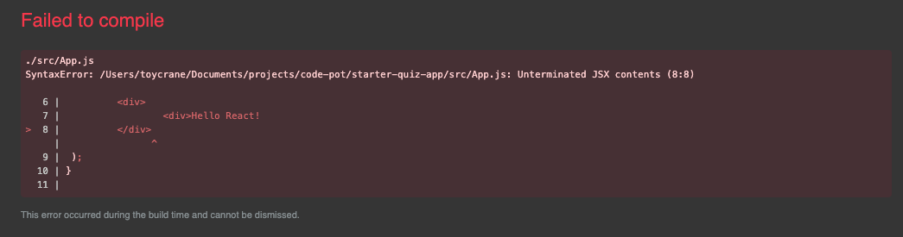
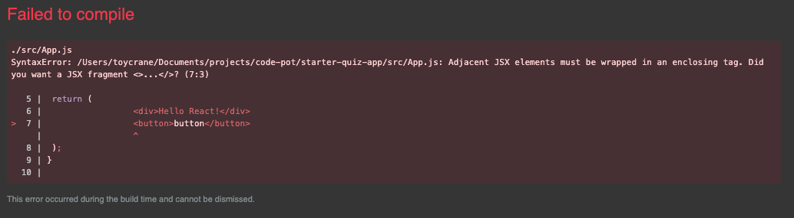

# HTML을 손쉽게 다루기 \(JSX\)

## 1. JSX가 뭐야?

```javascript
function App() {
  return (
    <div>Hello React!</div>
  );
}
```

위의 코드에서 `return` 부분을 보면 함수도 아니고, `String`도 아닌 이상한 문법이 있지 않나요?`<div>나의 첫 리액트 프로젝트</div>` 이 부분... 뭔가 이상하죠?   
이상하다고 생각하시는게 맞아요. 이게 바로 `JSX` 입니다.

**`JSX`는 `React`에서 `HTML`을 쉽게 사용할 수 있는 문법**이라고 보시면 됩니다.

그런데 브라우저는 HTML, CSS, Javascript만 이해할 수 있다고 배웠는데 어떻게 저런 문법을 사용할 수 있는 것 일까요? 이유는 `create-react-app`으로 `react` 코드를 최초 생성할 때, 설치되는 라이브러리 `babel`이 이 역할을 해줍니다. 

즉, 우리가 **`JSX`로 `HTML`을 작성하면 `React` 파일을 실행할 때 `babel`이 자동으로 `JSX` 코드를 `Javascript` 코드로 변환해 주는 것**이죠.

변환하면 어떻게 생겼냐구요?  
이렇게 생겼습니다.



짧게 설하면 `React` 내부의 `createElement` 함수가 `JSX` 내에 표현되어 있는 `HTML`을 우리가 원하는 장소에 `HTML`을 표현해주는 역할을 합니다.

자세한 내용은 이 파트에서 벗어 나므로, 추가로 궁금하시다면 **Something More!!** 을 참조해 주세요.

## 2. 유용한 JSX 어떻게 사용하면 될까?

`JSX`를 배웠으니, `JSX`의 유용한 문법들 몇 가지만 배워보도록 하겠습니다.

### JSX 내부에서 변수 사용하기

```javascript
const name = "code pot"
function App = () => {
	return <div>{name}</div>
}
```

먼저 변수를 `JSX` 내부에 넣어보도록 하겠습니다.  
위 코드처럼 변수를 중괄호로 감싸 JSX에서 사용할 수 있습니다.  
이외에도 함수, 삼항연산자 등 다양한 Javascript 표현식을 사용할 수 있습니다.  
앞으로도 많이 다룰테니, 여기서는 아래 두 가지만 다루고 갈께요!!

### JSX 내부에서 함수 호출하기

```javascript
const user = {
  firstName: 'toy',
  lastName: 'crane'
};

function formatName(user) {
  return user.firstName + ' ' + user.lastName;
}

function App = () => {
	return <div>{formatName(user)}</div>
}
```

`{}` 중괄호 안에 함수를 넣어서 HTML이 rendering될 때, 실행하게 할 수도 있습니다. 

### 삼항 연산자 사용하기

```javascript
const isLogin = true;
function App = () => {
	return {isLogin ? <div>로그인 완료</div> : <div>로그인 해주세요</div>
```

`React`에서는 `if`문 대신 코드가 간결해지는 위의 코드처럼 삼항 연산자를 많이 사용합니다.  
이외에도 많이 쓰이는 패턴들이 있는데, 한 번에 다 배우기 보단 과정을 진행하면서 하나씩 추가해보도록 하겠습니다.

## 3. JSX 사용시 이것만은... 꼭 주의 해주세요!!!!!!

### React import하기

JSX를 babel이 이해하고, Javascript로 변환하기 위해서는 `import React from "react"` 를 해주어야 합니다.

React v17 이후는 업데이트가 되면서 `import React from "react"` 를 넣지 않더라도 `babel`이 자동으로 `JSX`로 인식하고 javascript로 변환해 줍니다.

### HTML처럼 태그를 반드시 닫아야 해요

```javascript
function App() {
  return (
    <div>Hello React!
  );
}
```

닫지 않으면 태그를 닫아야 한다고 아래와 같이 컴파일 에러가 발생합니다.



### HTML과 달리 반드시 최상위 태그가 있어야 해요

```javascript
import React from "react";
import "./App.css";

function App() {
	return (
		// 컴포넌트 최상위 부모 태그
		<div>
			<div>Hello React!</div>
			<button>button</button>
		</div>
	);
}

export default App;
```

최상위 태그를 넣지 않으면?



마찬가지로 전체 엘리먼트를 `tag`로 감싸달라며, 컴파일 에러가 발생합니다.  
만약에 `div`를 최상위 태그로 넣기 싫다면, `<> </> fragment`를 사용하세요  
`fragment`는 브라우저에 나타나지 않는 태그로 다른 태그들을 감쌀 때 사용합니다.

## 4. Something More!!

* 바벨에 대해서 좀 더 이해하기
  * Babel 이해하기 -&gt; [https://medium.com/@ljs0705/babel-%EC%9D%B4%ED%95%B4%ED%95%98%EA%B8%B0-a1d0e6bd021a](https://medium.com/@ljs0705/babel-%EC%9D%B4%ED%95%B4%ED%95%98%EA%B8%B0-a1d0e6bd021a)

## 5. 질문이 있나요??


아래 링크를 통해 언제든 질문 해주세요 🙌   
[https://github.com/codepot-company/starter-quiz-app/discussions](https://github.com/codepot-company/starter-quiz-app/discussions)



