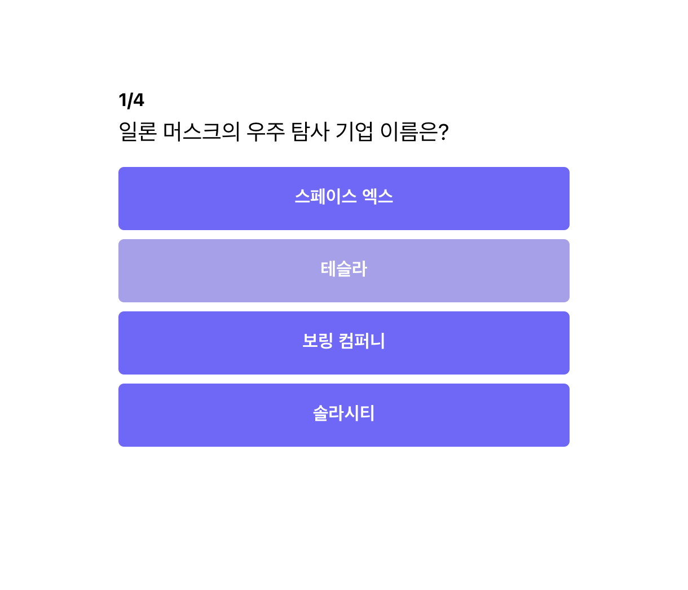
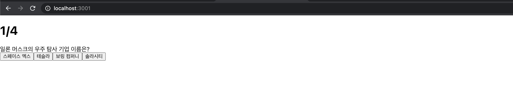
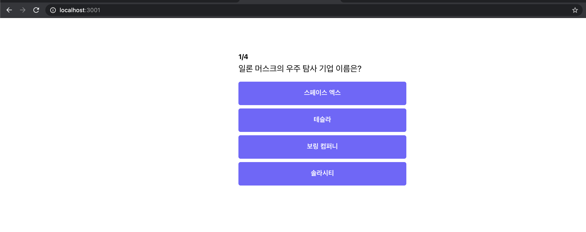

# 5. 퀴즈 페이지 디자인하기

컴포넌트 사용 방법을 알아 봤으니, 이제는 간단한 페이지를 만들어 보도록 하겠습니다.

아래와 같은 디자인으로 페이지를 만들어 보도록 하겠습니다.



## 1. App 구조 잡기

`App.js` 코드

```jsx
import "./App.css";
import React from "react";

function App() {
    return (
        <div className="container">
            <div className="app">
                <div className="question-section">
                    <h1 className="question-header">
                        <span>1</span>/4
                    </h1>
                    <div className="question-text">
                        일론 머스크의 우주 탐사 기업 이름은?
                    </div>
                </div>
                <div className="answer-section">
                    <button>스페이스 엑스</button>
                    <button>테슬라</button>
                    <button>보링 컴퍼니</button>
                    <button>솔라시티</button>
                </div>
            </div>
        </div>
    );
}

export default App;
```

퀴즈를 `className` 기준  `question-sction` 과 `answer-section` 로 두 영역으로 나눴습니다. 그리고 className이 `container` , `app`인 `div`로 전체 컴포넌트를 감싸 주었습니다.

`className`은 `HTML`에서 사용하는 선택자 `class`와 같습니다. `react`는 `html`의 속성으로 -를 사용할 수 없기 때문에, `camal case`로 속성 값을 작성합니다.


HTML과 선택자에 대한 이해가 부족하다면 아래의 강의를 보시고 오는 것을 추천 드립니다.

이고잉님의 HTML 강좌 -&gt; [보러가기](https://www.inflearn.com/course/html-%EA%B8%B0%EB%B3%B8#description) 


터미널에서 `npm start` 를 통해 위 코드를 실행해보도록 하겠습니다.



엇! 실행했더니 위와 같이 나오지 않던가요?

`CSS`가 적되지 않았네요. `HTML`을 꾸미려면 `CSS` 파일이 필요한데 `CSS` 파일을 아직 작성하지 않았습니다.

## 2. App Component에 CSS 입히기

처음에 있던 `App.css` 에 있던 내용을 지우고, 아래의 `CSS` 코드를 복사하여 붙여넣기 해주세요.

`App.css` 작성하기

```jsx
body {
    font-family: -apple-system, BlinkMacSystemFont, "Segoe UI", "Roboto", "Oxygen",
        "Ubuntu", "Cantarell", "Fira Sans", "Droid Sans", "Helvetica Neue",
        sans-serif;
}

.container {
    display: flex;
    justify-content: center;
    align-items: center;
}

.app {
    width: 400px;
    margin-top: 72px;
}

.question-section {
    margin-bottom: 16px;
}

.question-header {
    font-size: 16px;
    font-weight: bold;
    margin-bottom: 8px;
}

.question-text {
    font-size: 20px;
    margin-bottom: 8px;
}

.answer-section {
    display: flex;
    flex-direction: column;
    justify-content: center;
    align-items: center;
    margin-bottom: 8px;
}

button {
    font-size: 16px;
    color: #ffffff;
    background-color: rgb(115, 98, 255);
    border-radius: 5px;
    border: 0px;
    height: 56px;
    padding: 4px;
    margin: 4px;
    cursor: pointer;
    width: 100%;
    outline: none;
    font-weight: 700;
}

button:hover {
    background-color: #a99fee;
}
```

그리고 다시 터미널에서 터미널에서 `npm start` 를 통해 위 코드를 실행해보도록 하겠습니다.



  
드디어 처음에 보던 화면으로 제 브라우저에서 띄울 수 있게 되었습니다 👏👏👏  
  
상세한 CSS의 문법은 이번 수업의 범위에서 벗어나 자세하게 설명하지 않았습니다.    
혹시나 CSS가 궁금하신 분을 위해 몇 가지 핵심적으로 사용되는 문을 `Something More!!`에 추가해 두었으니, 참고 해주세요.

## 3. 전체 코드 살펴보기

* 깃허브에서 전체 코드 보기 -&gt; [바로가기](%20https://github.com/codepot-company/starter-quiz-app/tree/part2) 
* 온라인에서 마음대로 테스트 해보기 \(Code Sandbox\) -&gt; [바로가기](https://codesandbox.io/s/starter-quiz-app-part2-k0pit?file=/src/App.js) 

## 4. Something More!!

* CSS에서 요소를 선택하고, 스타일을 입히자
  * CSS 선택자 이해하기 → [http://www.nextree.co.kr/p8468/](http://www.nextree.co.kr/p8468/)
* CSS에서 배치는 어떻게 해야 할까?
  * Flex 완전 정복하기 → [https://studiomeal.com/archives/197](https://studiomeal.com/archives/197)

## 5. 질문이 있나요??


아래 링크를 통해 언제든 질문 해주세요 🙌   
[https://github.com/codepot-company/starter-quiz-app/discussions](https://github.com/codepot-company/starter-quiz-app/discussions)


