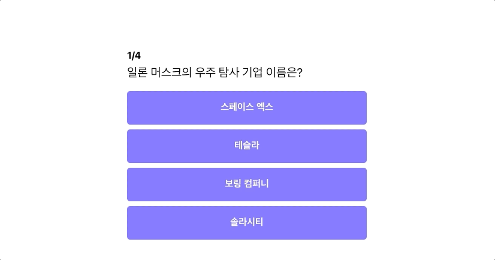

# 정답/오답 체크 기능 만들기



전체 틀을 만들었으니, 위에 보이는 화면처럼 간단한 정답 오답 체크 기능을 만들어 보도록 하겠습니다.

## 1. 질문들을 딕셔너리로 관리하기

`App.js`의 코드를 아래의 코드와 같이 바꿔보도록 하겠습니다.

```javascript
import "./App.css";
import React from "react";

function App() {
	const question = {
		questionText: "일론 머스크의 우주 탐사 기업 이름은?",
		answerOptions: [
			{ answerText: "스페이스 엑스", isCorrect: true },
			{ answerText: "테슬라", isCorrect: false },
			{ answerText: "보링 컴퍼니", isCorrect: false },
			{ answerText: "솔라시티", isCorrect: false },
		],
	};
	return (
		<div className="container">
			<div className="app">
				<div className="question-section">
					<h1 className="question-header">
						<span>1</span>/4
					</h1>
					<div className="question-text">{question.questionText}</div>
				</div>
				<div className="answer-section">
					<button>스페이스 엑스</button>
					<button>테슬라</button>
					<button>보링 컴퍼니</button>
					<button>솔라시티</button>
				</div>
			</div>
		</div>
	);
}

export default App;
```

question 변수를 하나 만들어 주었고, 내부에는 질문과 대답을 `dictionary` 형태로 만들어 저장해 두었습니다.

그리고 기존에 하드코딩 되어 있던 제목을 `{question.questionText}` 로 변경 해주었습니다.

`{}`은 React에서 변수를 다루는 방법으로 간단하게 알아보고 넘어가도록 하겠습니다.

## 2. React JSX와 표현식


