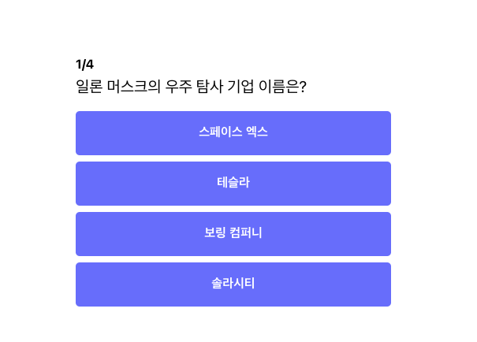
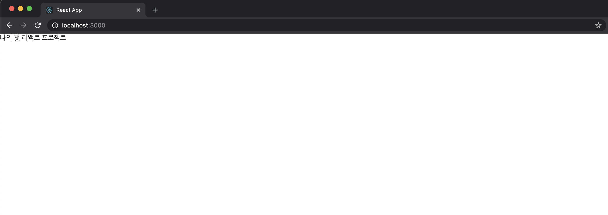

# 간단한 컴포넌트 만들어 보기

## 1. 컴포넌트?



**컴포넌트란 독립적이고 재사용 가능하도록 나눈 조각**을 뜻합니다. 위의 퀴즈 페이지를 예를 들어 보겠습니다. `Button`의 경우, 다른 요소들의 영향을 받지 않고, 홀로 어디서든 원하는 만큼 사용이 가능합니다. 뿐만 아니라 퀴즈의 제목도 마찬가지입니다. 이러한 속성을 가진 친구들을 컴포넌트라고 부르며, 리액트는 컴포넌트들을 조합해가면서 페이지를 만들어 나갑니다.

여기서 이해가 되지 않더라도, 코드를 진행하면서 천천히 이해가 될 것이니 너무 걱정하지 마세요. 그저 **컴포넌트는 독립적이고 재사용 가능하도록 나눈 조각**으로만 기억하고 넘어가겠습니다.

## 2. 리액트에서 컴포넌트 만들기

이제 간단하게 컴포넌트를 만들어 보도록 하겠습니다.

우선 `npx create-react-app` 명령어로 만들어진 기본 코드들을 정리하고 가겠습니다.

`app.js` 에 있는 아래 내용들을 전부 지우고, 코드를 아래와 같이 맞춰주세요.

```jsx
import React  from "react";
import './App.css';

function App() {
  return (
    <div>나의 첫 리액트 프로젝트</div>
  );
}

export default App;
```

그리고 나서 터미널에서 `npm start` 로 `React` 코드를 실행시켜 주세요.

실행 후, 아래와 같은 화면이 나오는 것을 볼 수 있습니다.



코드에 대해서 간략하게 설명해 보도록 하겠습니다.

`App` 함수는 `React` 컴포넌트이고, `return`에 우리가 화면에 그리고자 하는 `HTML`을 작성하면 `react`가 `HTML`을 인식하고 브라우저에 그려주게 됩니다.

이곳에 간단한 버튼을 추가해보도록 하겠습니다. 아래와 같이 버튼을 추가하면 웹 브라우저 상에서도 버튼이 노출 되는 것을 알 수 있습니다.

```jsx
import React from "react";
import "./App.css";

function App() {
    return (
        <div>
            나의 첫 리액트 프로젝트
            <button>버튼</button>
        </div>
    );
}

export default App;
```


\`\`

## 3. 전체 코드 살펴보기

* 깃허브에서 전체 코드 보기 -&gt; [바로가기](%20https://github.com/codepot-company/starter-quiz-app/tree/part1) 
* 온라인에서 마음대로 테스트 해보기 \(Code Sandbox\)-&gt;  [바로가기](https://codesandbox.io/s/starter-quiz-app-part2-k0pit?file=/src/App.js) 


`Code Sandbox`가 무엇인가요?

코드를 쉽게 공유하는 사이트로, 누구든지 쉽게 온라인에서 코드를 수정하고, 변경된 내용들을 바로 바로 확인 할 수 있는 툴입니다.


## 4. Something More!!

* `App` Component는 HTML 어디에 그려지는걸까?
  * [https://jeonghwan-kim.github.io/2018/07/16/react-app-overview.html](https://jeonghwan-kim.github.io/2018/07/16/react-app-overview.html)

## 5. 질문이 있나요??


아래 링크를 통해 언제든 질문 해주세요 🙌   
[https://github.com/codepot-company/starter-quiz-app/discussions](https://github.com/codepot-company/starter-quiz-app/discussions)


